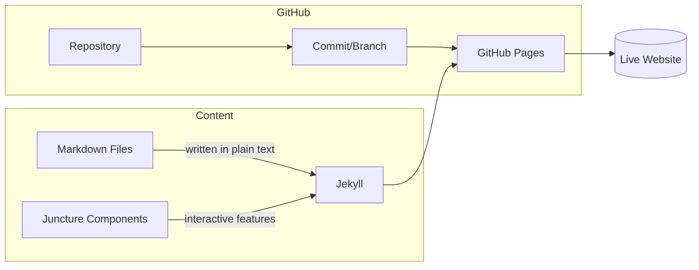

# Overview

This framework combines a few tools and services to make it easy to build and manage websites. You don’t need to be a developer to use it, but it helps to understand the building blocks.  

- **GitHub** – stores your content in a safe, organized way.  
- **GitHub Pages** – turns your stored content into a live website.  
- **Jekyll** – assembles and formats your content into web pages.  
- **Markdown** – a simple way of writing content using plain text.  
- **Juncture** – adds interactive features and enhancements to your content.  

---

## How the pieces fit together

    Markdown content  +  Juncture components
                │
                ▼
             Jekyll build
                │
                ▼
       GitHub Repository & Branches
                │
                ▼
           GitHub Pages
                │
                ▼
            Live Website

---

## Core Concepts

### GitHub

GitHub is an online service for storing and managing content. Think of it like a library or filing cabinet for your website materials.  

#### Repository
A **repository** (often called a *repo*) is a container for all the files related to your website—text, images, and settings.  

#### Branch
A **branch** is a separate version of the repository. Branches are often used to test changes without affecting the main site. The *main* branch is usually the live, published version.  

#### Commit
A **commit** is a “save point.” Every change you make to a file is stored as a commit, so you always have a history of what was changed and when.  

#### GitHub Pages
**GitHub Pages** is GitHub’s free web hosting service. It takes your repository, runs it through Jekyll, and publishes the result as a live website.  

---

### Markdown

**Markdown** is a simple text format used for writing content. It looks like plain text but includes easy symbols for formatting, like `#` for headings, `*` for bullet points, and `**bold**` for bold text.  

---

### Jekyll

**Jekyll** is the tool that builds your website. It takes Markdown files, combines them with layouts and settings, and outputs the final web pages.  

#### Collection
A **collection** groups similar content items, such as articles, events, or stories.  

#### Post
A **post** is a single piece of content, such as an article. Posts are written in Markdown and stored in a collection.  

#### Front Matter
**Front matter** is a block of settings at the top of a Markdown file. It stores things like the post’s title, date, author, tags, and categories.  

#### Tag
A **tag** is a label for organizing posts by topic, such as “gardening” or “travel.”  

#### Category
A **category** is a broader label that groups posts under main themes. For example, a post might be tagged “tomatoes” and categorized under “gardening.”  

#### Page
A **page** is like a post but usually more permanent, such as an “About” or “Contact” page.  

#### Layout
A **layout** is a template that controls how a page looks (header, footer, sidebars). Posts and pages select a layout in their front matter.  

#### Theme
A **theme** is a collection of layouts, styles, and settings that define the look and feel of the site.  

---

### Juncture

**Juncture** is a component library that adds interactive elements to your website. With Juncture, you can add features like image zooming, side-by-side comparisons, maps, and timelines—all from inside Markdown. This allows you to go beyond plain text and images to create engaging, interactive pages.  

---

## Additional Concepts (Nice to Know)

These terms aren’t essential at the beginning, but you may encounter them:  

- **Pull Request (PR)** – a way to propose changes before merging them into the main site.  
- **Issues** – GitHub’s built-in tool for tracking tasks, questions, or bugs.  
- **Build Process** – when GitHub Pages assembles your site; if something is broken, the build can fail.  
- **Custom Domain** – using your own web address instead of the default GitHub URL.  
- **HTTPS** – secure browsing for your site (the “lock” icon in the browser).  
- **Liquid** – the template language Jekyll uses for layouts; you may see snippets like `{{ title }}` in files.  
- **Includes** – reusable snippets of content, like a footer or navigation bar.  
- **Data Files** – YAML/JSON/CSV files that store structured information (like lists of events) separately from posts.  

